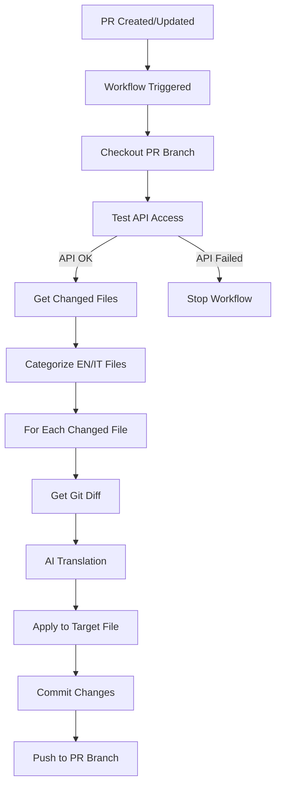

# Translation Sync Agent - Technical Architecture

## Overview

The translation synchronization system consists of several components working together to automate NethVoice documentation translation.

## Components

### 1. GitHub Workflow (`sync-translations.yml`)
- **Trigger**: Pull Request to `main` with changes to `.md` or `.mdx` files
- **Permissions**: `contents: write`, `pull-requests: write`
- **Conditions**: Only for internal repository PRs (not forks)

### 2. Translation Sync Agent (`translation-sync-agent.py`)
Python agent that handles the main logic:

#### Main Classes
- `DocumentationSyncAgent`: Main class that orchestrates the process

#### Key Methods
- `get_changed_files()`: Retrieves modified files via git diff
- `categorize_files()`: Distinguishes between English and Italian files
- `map_file_paths()`: Maps paths between the two languages
- `analyze_changes_with_ai()`: Uses GitHub Copilot GPT-5 Mini for translation
- `apply_translation_to_file()`: Applies translations to target files

### 3. Path Mapping

```
English Path Structure:
docs/
├── tutorial/
│   ├── index.md
│   └── cloud_vs_onpremise.md
├── administrator-manual/
└── user-manual/

Italian Path Structure:
i18n/it/docusaurus-plugin-content-docs/current/
├── tutorial/
│   ├── index.md
│   └── cloud_vs_onpremise.md
├── administrator-manual/
└── user-manual/
```

## Execution Flow



## Commit Management

### Conventional Commits Compliance

The system follows the Conventional Commits specification:
- **Format**: `docs: auto-sync translations for PR #<number>`
- **Type**: `docs` for documentation changes
- **Description**: Clear, standardized message format
- **Single Commit**: All translations for a PR are bundled into one commit

## AI Translation System

### Prompt Engineering
The system uses structured prompts to ensure:
- Maintenance of Markdown formatting
- Preservation of IDs, links and code
- Terminology consistency
- Appropriate tone for each language

### Prompt Example
```
You are a documentation translation agent for NethVoice...

TASK: Analyze the git diff and translate NEW/MODIFIED content

SOURCE: English
TARGET: Italian
FILE: docs/tutorial/index.md

RULES:
- Keep heading IDs: {#section-id}
- Bold for UI: **Install**
- Code in backticks: `value`
- Formal Italian tone
```

## Error Handling

### Git Errors
- Files not found → Skip with warning
- Merge conflicts → Stop execution
- Insufficient permissions → Fail workflow

### AI Errors
- API rate limit → Retry with backoff
- Untranslatable content → Skip with log
- Wrong output format → Fallback or manual review

### Fallback Strategies
1. Copy original content with missing translation note
2. Automatic issue creation for manual review
3. Team notification via PR comment

## Configuration

### Environment Variables
- `GITHUB_TOKEN`: Token for GitHub Models API and git operations (automatically available)

### Integrated Configuration
- Translation rules integrated in Python code
- AI parameters configured directly in the agent
- No external configuration files required

## Testing

### Integrated Tests
- Automatic API connectivity test in every PR
- GitHub token validation
- Available AI models verification

### Validation
- Preserved Markdown syntax check
- Internal links maintenance verification
- Consistent formatting check

## Performance

### Optimizations
- Common translations caching
- Batch processing for multiple files
- Parallel execution where possible

### Monitoring
- Structured logs for debugging
- Execution time metrics
- AI errors tracking

## Security

### Token Management
- GitHub Token automatically available in Actions
- Copilot API access through organization subscription
- No additional secret configuration required

### Permissions
- Minimal required permissions
- Scoped to documentation files
- Complete audit trail

## Current Limitations

1. **Complex Modifications**: Handles additions well, less so modifications to existing sections
2. **Context Awareness**: Doesn't maintain context between related files
3. **Quality Assurance**: Requires human review of translations
4. **File Dependencies**: Doesn't automatically handle related files (images, includes)